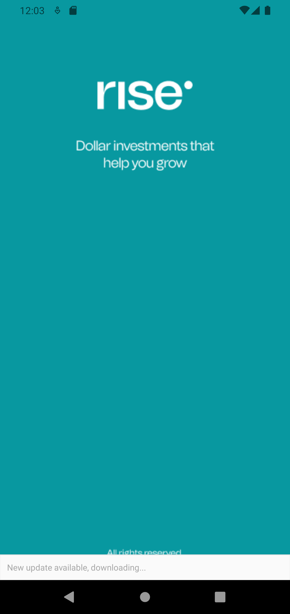
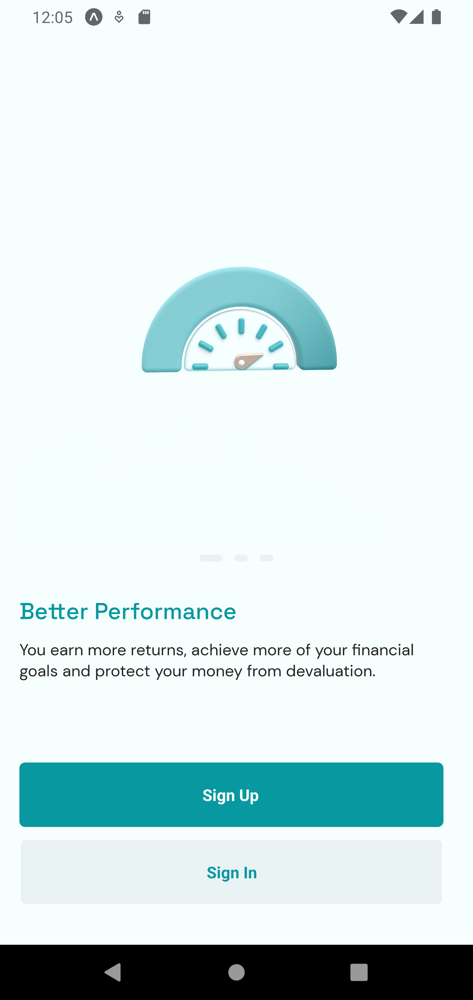
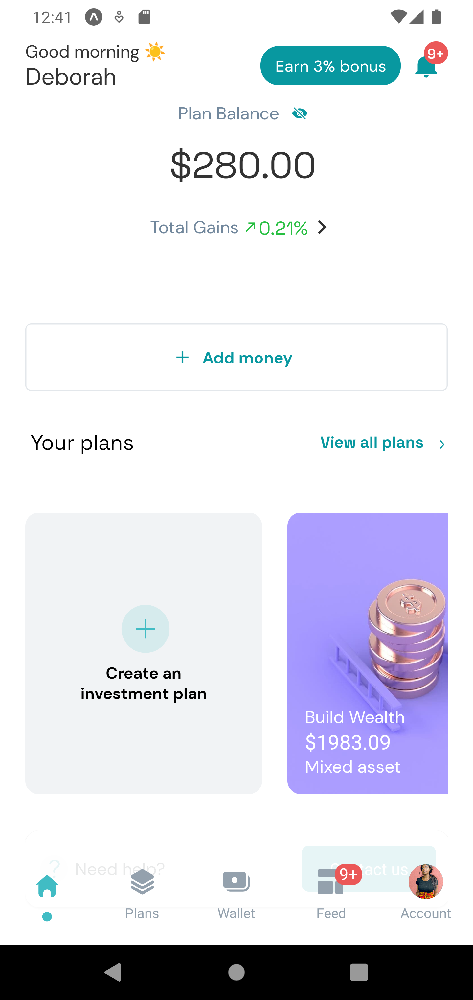

<h1>Note: The app is tested only with Android Emulator</h1>
<!-- 
 -->

<!-- 
 -->

<!--  -->

# RiseTest
This reactnative repository is created with the following packages:

- Node.js >> 18.2.1
-  Expo Cli >> 49.0.7
-   Eslint >> 8.47.0
-   Prettier >> 3.0.2

# Dependencies
- @expo-google-fonts/dm-sans: ^0.2.3 
- @expo-google-fonts/space-grotesk: ^0.2.3
-  @gorhom/bottom-sheet: ^4.4.7
 - @react-native-async-storage/async-storage: 1.18.2
 - @react-navigation/bottom-tabs: ^6.5.8
- @react-navigation/native: ^6.1.7
- @react-navigation/native-stack: ^6.9.13
- @reduxjs/toolkit: ^1.9.5
 - @tanstack/react-query: ^4.33.0
-  axios: ^1.5.0
-  expo: ~49.0.7
 - expo-app-loading: ^2.1.1
- expo-font": ~11.4.0
-  expo-splash-screen: ~0.20.5
-  expo-status-bar: ~1.6.0
-  formik: ^2.4.3
-  react: 18.2.0
-  react-native: 0.72.4
-  react-native-calendars: ^1.1300.0
-   react-native-confirmation-code-field: ^7.3.1
-  react-native-gesture-handler: ~2.12.0
-   react-native-paper: ^5.10.3
 -  react-native-phone-number-input: ^2.1.0
-   react-native-reanimated: ~3.3.0
- react-native-safe-area-context: 4.6.3
- react-native-screens: ~3.22.0
- react-native-svg: 13.9.0
- react-native-svg-transformer: ^1.1.0
 - react-native-vector-icons: ^10.0.0
 - react-redux: ^8.1.2
 - yup: ^1.2.0

# Overview

It is created as a test app for Rise recruitment purposes. Below is the <a href="https://www.figma.com/file/QSqLkRsYd3b9VhJ4CfWuqD/React-Native-Test-from-Rise?type=design&node-id=0-1&mode=design">figma</a>  design of the app.

The design is segregated into six categories which are essential parts of Rise mobile app which is available for their customers on both Playstore and AppStore.

 The Categories are:
-  Sign Up
-  Sign In
-  Set Pin
-  Homepage
-  Goal Based Plan
-  Fund Plan From Home

The above catgeories are created inside the repository respectively for easy flow.

Each categories has its own screens which are all listed in the folders.

